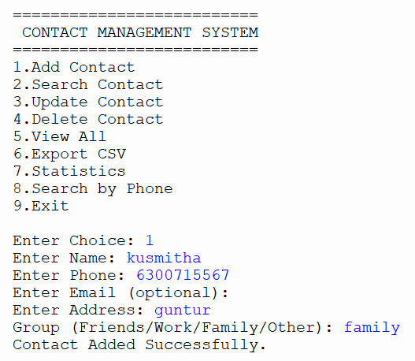
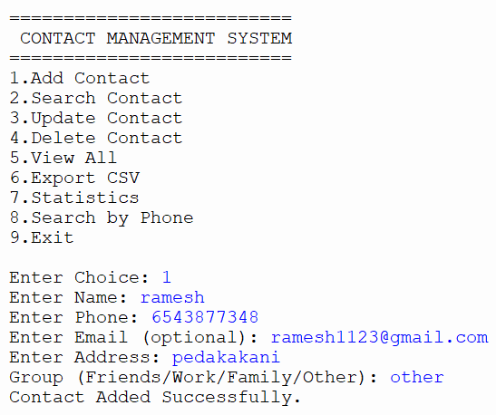
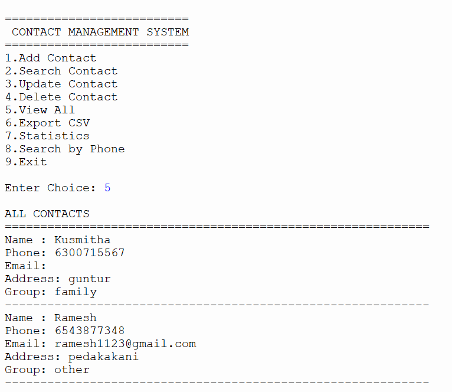

# week-3-contact-manager
# 📖 Contact Management System

## Project Description

The **Contact Management System** is a Python-based console application that allows users to efficiently manage contact information. The project demonstrates the use of **functions, dictionaries, file handling, JSON, CSV, input validation, and error handling**.

The application stores contact information such as **name, phone number, email address, address, and group/category**, allowing users to perform complete CRUD (Create, Read, Update, Delete) operations. Contact data is automatically saved in a JSON file, ensuring information is preserved between program executions.

---

# What I Learned

Through this project, I gained practical experience with:

* Creating reusable functions
* Using dictionaries and nested dictionaries
* Implementing CRUD operations
* Working with JSON files for data persistence
* Exporting data to CSV files
* Using regular expressions for phone number and email validation
* Applying string methods for formatting and searching
* Implementing input validation
* Handling exceptions and file errors gracefully
* Designing a menu-driven console application

---

# Features

* ✔ Add New Contact
* ✔ Search Contacts by Name (Partial Matching)
* ✔ Search Contacts by Phone Number
* ✔ Update Existing Contact Information
* ✔ Delete Contacts with Confirmation
* ✔ Display All Contacts
* ✔ Save Contacts Automatically to JSON
* ✔ Load Contacts on Program Startup
* ✔ Backup Contact Data
* ✔ Export Contacts to CSV
* ✔ View Contact Statistics
* ✔ Phone Number Validation
* ✔ Email Validation
* ✔ User-Friendly Menu Interface
* ✔ Error Handling for Invalid Inputs

---

# Technologies Used

* Python 3
* Dictionaries
* Functions
* JSON
* CSV
* File Handling
* Regular Expressions (`re`)
* `datetime` Module
* `os` Module

---

# Project Structure

```text
week3-contact-manager/
│── contacts_manager.py
│── contacts_data.json
│── test_contacts.py
│── README.md
│── requirements.txt
└── .gitignore
```

---

# Setup Instructions

### 1. Navigate to the Project Folder

```bash
cd week3-contact-manager
```

### 2. Install Requirements

This project uses only Python's built-in libraries, so no additional packages are required.

```bash
pip install -r requirements.txt
```

### 3. Run the Program

```bash
python contacts_manager.py
```

### 4. Run Unit Tests

```bash
python test_contacts.py
```

---

# Data Structure

The contacts are stored as nested dictionaries.

```python
contacts = {
    "John Doe": {
        "phone": "1234567890",
        "email": "john@example.com",
        "address": "123 Main Street",
        "group": "Friends",
        "created_at": "2026-07-29T18:30:25",
        "updated_at": "2026-07-29T18:30:25"
    },
    "Jane Smith": {
        "phone": "9876543210",
        "email": "jane@example.com",
        "address": "456 Oak Avenue",
        "group": "Work",
        "created_at": "2026-07-29T18:45:10",
        "updated_at": "2026-07-29T18:45:10"
    }
}
```

---

# Main Menu

```text
====================================
     CONTACT MANAGEMENT SYSTEM
====================================

1. Add New Contact
2. Search Contact
3. Update Contact
4. Delete Contact
5. View All Contacts
6. Export to CSV
7. View Statistics
8. Search by Phone Number
9. Exit
```

---

# Sample Output

```text
--- ADD NEW CONTACT ---

Enter Name: John Doe
Enter Phone Number: +1 (234) 567-8900
Enter Email: john@example.com
Enter Address: 123 Main Street
Enter Group: Friends

✅ Contact Added Successfully.
```

```text
--- SEARCH RESULTS ---

Name : John Doe
Phone: 12345678900
Email: john@example.com
Address: 123 Main Street
Group: Friends
```

```text
--- CONTACT STATISTICS ---

Total Contacts : 10

Friends : 4
Family  : 2
Work    : 3
Other   : 1
```

---

# Screenshots

## sample inputs:
1. sample_input_1 : 
2. sample_input_2 : 

## sample_output: 
sample_output : 

   
# Challenges & Solutions

### Challenge 1: Handling Duplicate Contact Names

**Solution:**
The program checks whether a contact already exists before adding a new one and prevents duplicate entries.

---

### Challenge 2: Phone Number Validation

**Solution:**
Regular expressions are used to remove non-digit characters and validate phone numbers containing between 10 and 15 digits.

---

### Challenge 3: Email Validation

**Solution:**
Email addresses are validated using regular expressions before they are saved.

---

### Challenge 4: Efficient Partial Search

**Solution:**
The application converts both stored names and the search keyword to lowercase, enabling fast and case-insensitive partial matching.

---

### Challenge 5: Data Persistence

**Solution:**
Contact information is automatically saved to a JSON file after every modification and loaded whenever the application starts.

---

### Challenge 6: Exporting Contacts

**Solution:**
The application exports all contacts to a CSV file, making it easy to share or back up contact information.


## Author

**Kusmitha**

Week 3 Python Project
